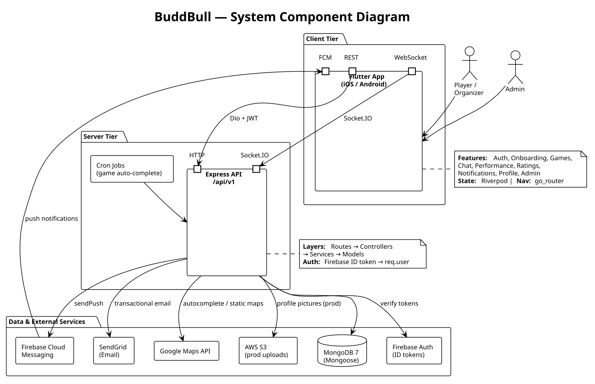

# BuddBull

[](https://github.com/rahmo96/BuddBull/actions/workflows/buddbull-ci.yml)

**A social-sport app for finding people to play with, organizing games, and tracking your progress.**

BuddBull is a Flutter mobile app (iOS & Android) backed by a Node.js / Express / MongoDB API with real-time chat over Socket.io and Firebase for authentication and push notifications.

## Features

- **Games** — create, search, and join pickup games; organizers approve join requests, invite friends, kick players, and merge groups. Calendar view and automatic completion of past games.
- **Performance tracking** — log matches and training sessions, see stats, streaks, progress charts, and per-sport leaderboards.
- **Chat** — a group chat for every game plus direct messages, with read receipts, reactions, replies, and pinned messages.
- **Ratings** — rate other players on reliability and behavior after a game.
- **Social** — profiles, followers, friend requests, and user search.
- **Notifications** — push notifications (Firebase Cloud Messaging), an in-app inbox, and scheduled pre-game reminders.
- **Moderation** — user reports and an admin dashboard for managing users, games, sports, and reports, with CSV export and broadcast messages.

## Quick start

### Prerequisites

- [Docker](https://docs.docker.com/get-docker/) — or Node.js ≥ 18 to run the API without Docker
- A MongoDB database (local or [Atlas](https://www.mongodb.com/atlas))
- A [Firebase](https://console.firebase.google.com/) project with Authentication enabled
- Flutter ≥ 3.24 (Dart ≥ 3.5)

### 1. Start the backend

```bash
git clone https://github.com/rahmo96/BuddBull.git
cd BuddBull
```

Create `backend/.env` with at least the required variables from [Configuration](#configuration). Set `PORT=5000` so it matches the ports in `docker-compose.yml`, then start the API:

```bash
docker compose up -d
```

Check that it's running:

```bash
curl http://127.0.0.1:5000/health
```

<details>
<summary>Run without Docker</summary>

```bash
cd backend
npm install
npm run dev
```

</details>

### 2. Run the app

The app is already set up for BuddBull's Firebase project (`lib/firebase_options.dart`). If you use your own Firebase project, regenerate that file with the [FlutterFire CLI](https://firebase.google.com/docs/flutter/setup) (`flutterfire configure`). The backend's Firebase Admin credentials must belong to the same project.

```bash
cd frontend
flutter pub get
flutter run --dart-define=API_BASE_URL=http://10.0.2.2:5000/api/v1
```

Use `http://10.0.2.2:5000/api/v1` for the Android emulator and `http://127.0.0.1:5000/api/v1` for the iOS simulator or desktop. Without `API_BASE_URL`, the app connects to the production server.

## Configuration

The backend reads its settings from `backend/.env`. They're validated at startup by [`src/config/environment.js`](backend/src/config/environment.js), and the server **refuses to start** if a required value is missing or invalid.

| Variable | Required | Default | Notes |
|---|---|---|---|
| `MONGO_URI` | ✅ | — | Must start with `mongodb://` or `mongodb+srv://` |
| `JWT_SECRET` | ✅ | — | At least 32 characters |
| `JWT_REFRESH_SECRET` | ✅ | — | At least 32 characters |
| `EMAIL_HOST` | ✅ | — | SMTP host |
| `EMAIL_USER` | ✅ | — | SMTP username |
| `EMAIL_PASS` | ✅ | — | SMTP password |
| `EMAIL_PORT` | | `587` | |
| `EMAIL_SECURE` | | `false` | |
| `EMAIL_FROM` | | `BuddBull <noreply@buddbull.app>` | |
| `PORT` | | `3000` | Use `5000` with `docker-compose.yml` |
| `NODE_ENV` | | `development` | `development`, `test`, or `production` |
| `CLIENT_URL` | | `http://localhost:3000` | Allowed CORS / Socket.io origin in production |
| `UPLOAD_DIR` | | `uploads/` | Where uploaded images are stored |
| `RATE_LIMIT_WINDOW_MS` | | `900000` (15 min) | |
| `RATE_LIMIT_MAX` | | `500` | Requests per window per IP |
| `GOOGLE_MAPS_API_KEY` | | empty | Needed for place autocomplete and map previews |

**Firebase Admin credentials** are also required to verify sign-ins and send push notifications. Either set `GOOGLE_APPLICATION_CREDENTIALS` to a service-account JSON file, or set all three of `FIREBASE_PROJECT_ID`, `FIREBASE_CLIENT_EMAIL`, and `FIREBASE_PRIVATE_KEY`.

Optional scheduler settings: `RETENTION_CRON_HOUR` (default `19`) and `RETENTION_CRON_TZ` (default `UTC`) control the daily retention-reminder job.

## Architecture



| Layer | Technology |
|---|---|
| Mobile app | Flutter · Riverpod · go_router · Dio · fl_chart · table_calendar |
| API | Node.js · Express 4 · Joi / express-validator |
| Database | MongoDB · Mongoose 8 |
| Real-time | Socket.io 4 |
| Auth | Firebase Authentication (the API verifies Firebase ID tokens with `firebase-admin`) |
| Notifications | Firebase Cloud Messaging · Agenda (scheduled jobs) · node-cron |
| Email | Nodemailer (any SMTP provider) |
| Logging | Winston · Morgan |
| Testing | Jest · Supertest · mongodb-memory-server · Artillery · flutter_test |
| DevOps | Docker · GitHub Actions |

More diagrams live in [`docs/`](docs/): [backend architecture](docs/BuddBull_Backend_Architecture.svg), [frontend architecture](docs/BuddBull_Frontend_Architecture.svg), [domain model](docs/BuddBull_Domain_Model.svg), [use cases](docs/BuddBull_UseCase_Overview.svg), and sequence diagrams for [auth](docs/BuddBull_Sequence_Auth.svg), [joining a game](docs/BuddBull_Sequence_JoinGame.svg), and [chat](docs/BuddBull_Sequence_Chat.svg).

### Security

- Every protected route verifies a Firebase ID token (`Authorization: Bearer <token>`) and checks that the account is active and not banned.
- Role-based access control (`player`, `organizer`, `admin`).
- `helmet` security headers, NoSQL-injection and XSS sanitization, and a CORS allow-list.
- Rate limiting on `/api/` routes in production.
- A central error handler that hides stack traces in production.

## Development

### Backend (`backend/`)

| Command | What it does |
|---|---|
| `npm run dev` | Start the API with hot reload (nodemon) |
| `npm start` | Start the API with Node |
| `npm test` | Run the Jest test suite |
| `npm run test:watch` | Run tests in watch mode |
| `npm run test:coverage` | Run tests with a coverage report |
| `npm run lint` / `npm run lint:fix` | Lint with ESLint (Airbnb) |
| `npm run format` | Format with Prettier |
| `npm run seed:games` | Seed sample games |
| `npm run seed:demo-activity` | Seed demo activity data |
| `npm run load-test` | Run the Artillery load test and write an HTML report |

### Frontend (`frontend/`)

```bash
flutter analyze
flutter test
flutter build apk --release
flutter build ios
```

### CI

[GitHub Actions](.github/workflows/buddbull-ci.yml) runs on pushes and pull requests to `main`. It only runs jobs for the parts of the repo that changed:

- **Backend:** `npm ci`, lint, and tests on Node.js 20
- **Frontend:** `flutter analyze`, `flutter test`, and a release APK build, which it uploads as a build artifact

## Project structure

```
BuddBull/
├── backend/
│   ├── server.js            # HTTP + Socket.io entry point, scheduled jobs
│   ├── src/
│   │   ├── app.js           # Express app, middleware, route mounting
│   │   ├── config/          # env validation, database, Agenda
│   │   ├── models/          # Mongoose schemas
│   │   ├── routes/          # /api/v1/* routers
│   │   ├── controllers/
│   │   ├── services/        # business logic
│   │   ├── validators/
│   │   ├── middleware/      # auth, uploads, errors
│   │   ├── socket/          # Socket.io handlers
│   │   └── utils/
│   ├── scripts/             # seed scripts
│   └── tests/
├── frontend/
│   └── lib/
│       ├── main.dart
│       ├── firebase_options.dart
│       ├── core/            # network, router, theme, services
│       ├── features/        # admin, auth, chat, games, home, notifications,
│       │                    # onboarding, performance, profile, rating, reports, search
│       └── shared/          # reusable widgets
├── docs/                    # UML and architecture diagrams, manual test cases
├── docker-compose.yml       # local API container
└── nginx.conf
```
